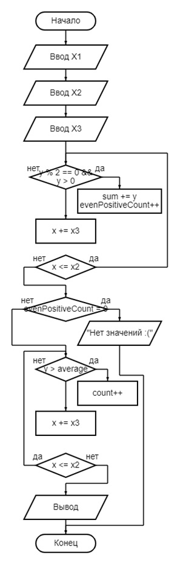
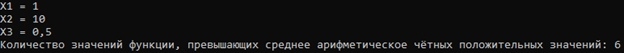

# Лабораторная работа 4
**1.** Функция Y=f(x), x1<=x<=x2, шаг - x3. Определить количество значений функции, превышающих среднее арифметическое чётных положительных значений.
____
**Оператор "for":**

Рис. 1 - блок-схема
____
**Оператор "while":**

Рис. 2 - блок-схема
____
**Оператор "do-while":**

Рис. 3 - блок-схема
____
**Вывод программ:**

Рис. 4 - вывод программ